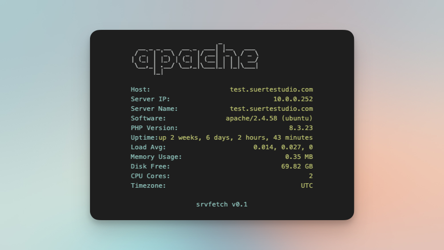

# Server Fetch

Minimal “neofetch”-style splash for your web server.

## Files

- **index.php** — loads logic and view
- **srvfetch/splash_data.php** — gathers server info and selects ASCII logo
- **srvfetch/splash_view.php** — renders HTML/CSS

## Requirements

- PHP 7+
- shell_exec or proc_open enabled

## Install

1. Copy all three files to your vhost root
2. Ensure `index.php` is first in `DirectoryIndex`

## Customize

- Edit ASCII blocks in `splash_data.php`
- Add/remove entries in the `$info` array
- Tweak styles in `splash_view.php`  